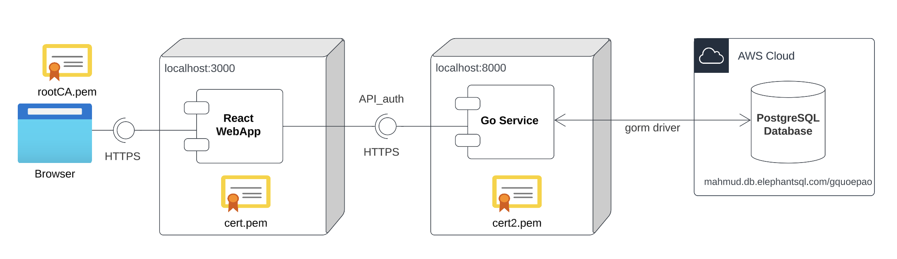
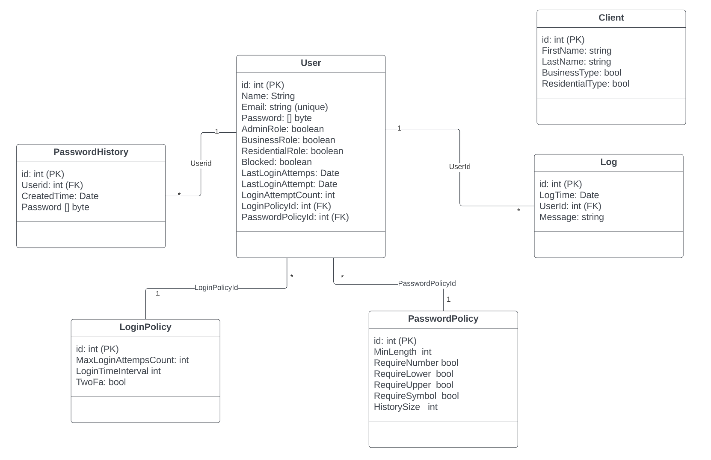
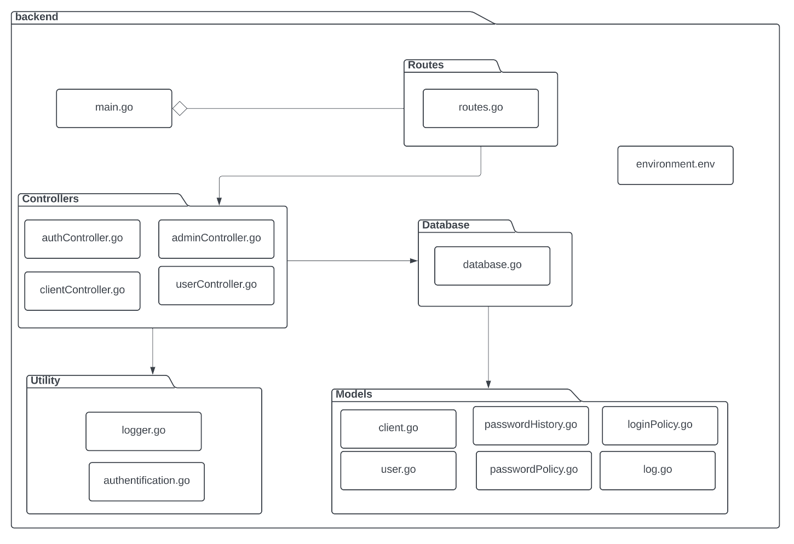

# Get started
## Step 1: Add root certification authority to your browser
`rootCA.crt`

## Step 2: Go service 
install go: https://go.dev/dl/
#### Dependencies 
- `go get github.com/gofiber/fiber/v2`
- `go get -u gorm.io/gorm`
- `go get -u gorm.io/driver/postgres`
- `go get github.com/gofiber/fiber/v2/middleware/cors`
- `go get github.com/mattn/go-isatty@v0.0.17` 
- `go get github.com/dgrijalva/jwt-go`
- `go get golang.org/x/crypto/bcrypt` 
- `go get github.com/joho/godotenv`
#### Start app 
- `cd backend`
- `go run main.go`

## Step 3: React Webapp
- `cd frontend`
- `npm install`
#### Start app 

- Windows-> `npm run start`
- Unix-> `npm run startu`

# Documentation
## API_auth (Postman)
https://documenter.getpostman.com/view/23723955/2s93RL1G2n 

## Architecture

## Data Model

## Module view - Go service

